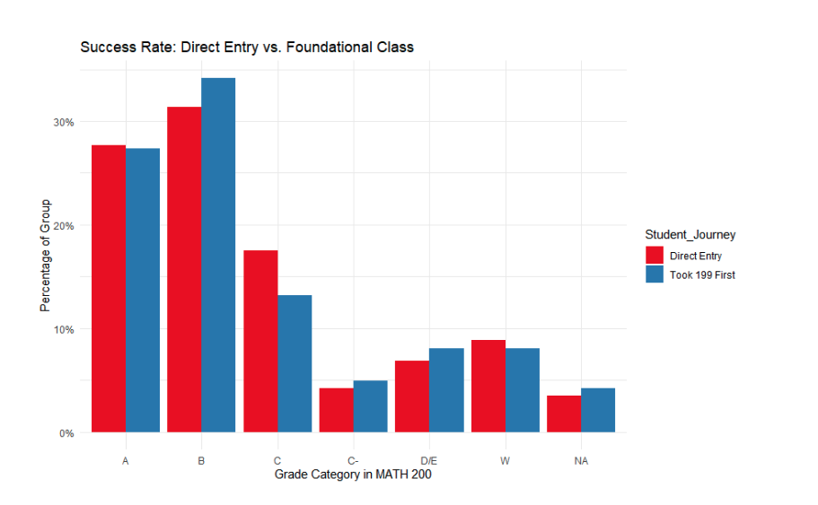
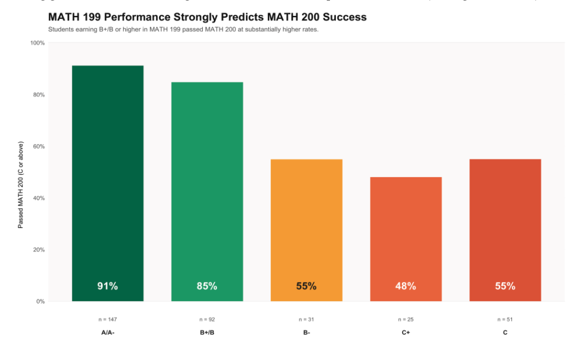
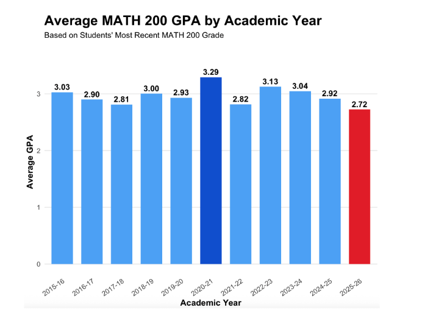
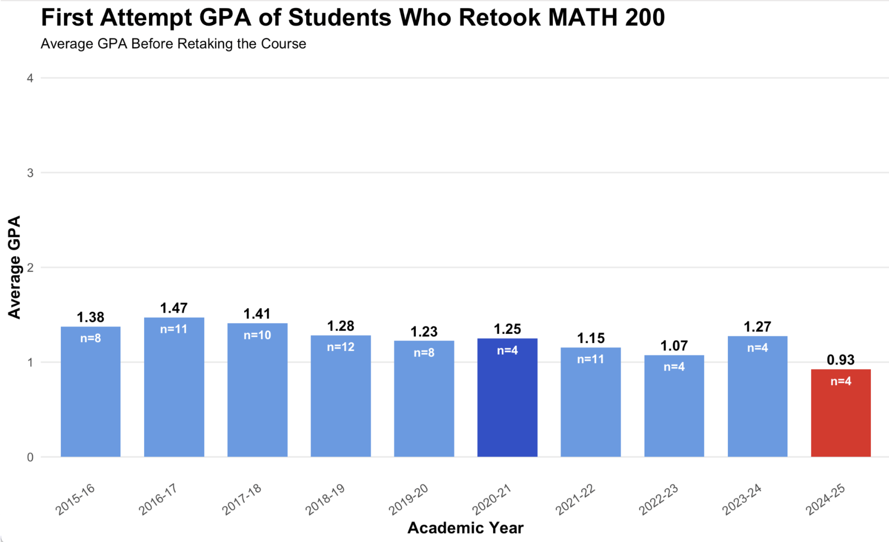
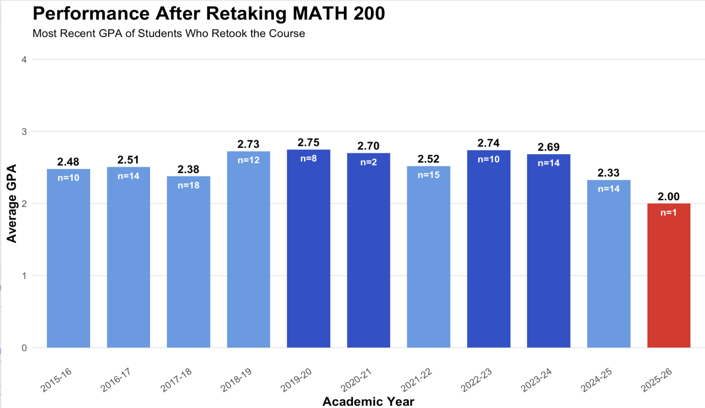

```{=html}
<link rel="preconnect" href="https://fonts.googleapis.com">
<link rel="preconnect" href="https://fonts.gstatic.com" crossorigin>
<link href="https://fonts.googleapis.com/css2?family=Playfair+Display:ital,wght@0,700;0,900;1,700&family=DM+Sans:wght@300;400;500&family=DM+Mono:wght@400;500&display=swap" rel="stylesheet">
```

<!-- ============================================================ -->
<!--  OPENING -- centered, full width                              -->
<!-- ============================================================ -->

:::{.cr-section .no-sidebar}

<div class="opening-wrap">
<p class="hero-text">What actually predicts success in <span class="accent">MATH 200?</span></p>
<p class="opening-sub">Using student records spanning over a decade, we explored three questions about the course that determines whether students move forward in mathematics.</p>
<div class="three-questions">
  <div class="q-chip" data-n="01">Does taking MATH 199 first make a difference?</div>
  <div class="q-chip" data-n="02">Is there a grade in MATH 199 that predicts success?</div>
  <div class="q-chip" data-n="03">How has performance shifted over time -- and what happens to students who retake?</div>
</div>
<p class="scroll-cue">Scroll to explore</p>
</div>

:::

<!-- ============================================================ -->
<!--  QUESTION 1 -- INTRO centered, full width                    -->
<!-- ============================================================ -->

:::{.cr-section .no-sidebar}

<div class="centered-intro">
<span class="section-pill">Question 01</span>

<p class="q-heading">What happens to a student's grade in MATH 200 if they were placed higher but chose to take MATH 199 first?</p>

<p class="intro-body">We expected the extra preparation to help -- that students who voluntarily stepped back to take MATH 199 first would outperform those who entered MATH 200 directly.</p>

<div class="note-box">
<span class="note-label">A note on grade groupings</span>
<strong>A and A-</strong> are combined. <strong>B-, B, and B+</strong> are combined. Grouping similar grades together helps us see the bigger picture without getting lost in the details.
<br><br>
<strong>C</strong> and <strong>C-</strong> are kept separate, because that boundary is where passing starts to get shaky.
<br><br>
<strong>W means withdrawal</strong> -- a student who started MATH 200 but did not finish.
</div>
</div>

:::

<!-- ============================================================ -->
<!--  QUESTION 1 -- CHART sidebar                                 -->
<!-- ============================================================ -->

:::{.cr-section}

:::{#cr-q1}

:::

Here is how the two groups compare across every grade outcome in MATH 200. **Red** = students who went directly into MATH 200. **Blue** = students who took MATH 199 first, even though they were placed higher.

@cr-q1

At the top of the grade range -- the **A and B columns** -- the two groups look almost identical. Students who took MATH 199 first performed just as well, or slightly better, at the A and B level. The extra preparation did not hold them back.

[@cr-q1]{pan-to="-30%,0%" scale-by="1.6"}

Now look at the **C column.** Direct entry students are more likely to land at a C -- the floor of passing. Students who took MATH 199 first are less likely to end up here.

[@cr-q1]{pan-to="10%,0%" scale-by="1.8"}

Look at the **W column** -- withdrawals. Direct entry students withdraw at a slightly higher rate. It is a small difference, but it points in the same direction as everything else we are seeing.

[@cr-q1]{pan-to="45%,0%" scale-by="2"}

The caveat to this is that while the two groups may be very similar overall, most foundational students are getting higher than a C -- while direct entry students are getting more Cs and more withdrawals. Taking a step back to build foundations did not hurt these students. For many, it quietly shifted their grades upward.

@cr-q1

<p class="bridge">So taking MATH 199 first seems to help. But does how well you do in MATH 199 matter?</p>

:::

<!-- ============================================================ -->
<!--  QUESTION 2 -- INTRO centered, full width                    -->
<!-- ============================================================ -->

:::{.cr-section .no-sidebar}

<div class="centered-intro">
<span class="section-pill">Question 02</span>

<p class="q-heading">Is there a specific grade in MATH 199 that reliably predicts success in MATH 200?</p>

<p class="intro-body">We expected that earning a B or higher in MATH 199 would be a good sign. But the data told a more specific story -- and it changed how we grouped the grades.</p>

<div class="note-box">
<span class="note-label">Why B- stands alone</span>
In Question 1, we combined B-, B, and B+ into one group because they told a similar story. But for this question, that grouping would have hidden something important.
<br><br>
When we looked at pass rates after earning a B- vs. a B or B+, the difference was too large to ignore. <strong>B- stands on its own here.</strong> Grouping similar grades helps -- but only when those grades are telling the same story. Here, they were not.
</div>
</div>

:::

<!-- ============================================================ -->
<!--  QUESTION 2 -- CHART sidebar                                 -->
<!-- ============================================================ -->

:::{.cr-section}

:::{#cr-q2}

:::
@cr-q2

This chart shows the share of students who passed MATH 200 -- earning a C or better -- based on their most recent grade in MATH 199. The higher the bar, the better the outcome.

[@cr-q2]{pan-to="30%,0%" scale-by="1.8"}

<span class="stat-pop">91%</span> 
<span class="stat-label">of A/A- students passed MATH 200 &nbsp;(n = 147)</span>

That is the strongest signal in the dataset -- nearly 9 out of 10 students in this group went on to pass. With 147 students behind it, this is the largest and most reliable group.

[@cr-q2]{pan-to="-42%,-20%" scale-by="1.8"}

<span class="stat-pop">85%</span>
<span class="stat-label">of B+/B students passed MATH 200 &nbsp;(n = 92)</span>

The picture shifts meaningfully for students earning a **B+ or B** -- but still in a good direction. Both groups sit comfortably above the 75% reliability threshold used in this analysis.

[@cr-q2]{pan-to="-60%,0%" scale-by="1.8"}

<div class="cliff-block">
<span class="cliff-label">Warning signal</span>
Then something happens at the <strong>B-.</strong> The pass rate drops sharply -- from 85% all the way down to <strong>55%.</strong> That is not a gradual slide. That is a cliff.
<br><br>
This is exactly why B- could not be grouped with B and B+. A student earning a B- in MATH 199 is in a fundamentally different position than a student earning a B.
</div>

[@cr-q2]{pan-to="-80%,0%" scale-by="1.8"}

<span class="stat-pop">48%</span>
<span class="stat-label">of C+ students passed MATH 200 &nbsp;(n = 25)</span>

Less than half. Below the B- and well below the 75% threshold. Worth noting: 25 students is the smallest group in the chart, so this estimate carries more uncertainty.

[@cr-q2]{pan-to="-100%,0%" scale-by="1.8"}

<span class="stat-pop">55%</span>
<span class="stat-label">of C students passed MATH 200 &nbsp;(n = 51)</span>

Despite earning a lower grade in MATH 199, this group performed similarly to B- students in MATH 200. The caveat to this is that 51 students is a modest sample size.

[@cr-q2]{pan-to="42%,0%" scale-by="1.8"}

The picture is clear. Students who earned a **B or higher** in MATH 199 passed MATH 200 at rates well above 75%. Students who earned a **B- or lower** did not. For advisors, this is the simplest evidence-based tool in the data.

@cr-q2

<p class="bridge">So we know taking MATH 199 helps, and how well you do in it matters. But has any of this changed over time?</p>

:::

<!-- ============================================================ -->
<!--  QUESTION 3a -- INTRO centered, full width                   -->
<!-- ============================================================ -->

:::{.cr-section .no-sidebar}

<div class="centered-intro">
<span class="section-pill">Question 03</span>

<p class="q-heading">Which academic years showed the strongest average grades in MATH 200?</p>

<p class="intro-body">We expected some year-to-year variation -- different cohorts, different instructors, and external factors like the pandemic. Here is what the data actually showed across eleven academic years.</p>

<div class="note-box">
<span class="note-label">What this chart measures</span>
Each bar represents the <strong>average GPA</strong> of students in that academic year, based on their most recent MATH 200 grade. For students who took the course only once, that is their final grade. For retakers, that is the grade from their most recent attempt.
<br><br>
The <strong>dark blue</strong> bar flags the pandemic year. The <strong>red</strong> bar flags the current year, which may still be in progress.
</div>
</div>

:::

<!-- ============================================================ -->
<!--  QUESTION 3a -- CHART sidebar                                -->
<!-- ============================================================ -->

:::{.cr-section}

:::{#cr-q3a}

:::

Here is MATH 200 average GPA across every academic year from 2015-16 through 2025-26. Take a moment to notice the overall shape -- most bars are sitting close together, with a few clear exceptions.

[@cr-q3a]{scale-by="1.3"}

In the five years before the pandemic -- **2015-16 through 2019-20** -- average MATH 200 GPA ranged from **2.81 to 3.03.** The numbers move around a little year to year, but they are all telling the same story. This is what a normal baseline looks like.

[@cr-q3a]{pan-to="-55%,0%" scale-by="1.9"}

Then came **2020-21.**

<span class="stat-pop">3.29</span>
<span class="stat-label">Highest average GPA in the entire dataset</span>

This coincides with the shift to remote and hybrid learning during COVID-19, which may have altered grading practices or student study habits. This year stands clearly apart from everything before and after it.

[@cr-q3a]{pan-to="-65%,0%" scale-by="2.2"}

The following year, **2021-22**, GPA dropped back down to **2.82** -- nearly returning to the pre-pandemic baseline almost immediately. The pandemic spike did not carry forward.

[@cr-q3a]{pan-to="-95%,0%" scale-by="2.2"}

**2022-23 and 2023-24** both performed above the long-run average at **3.13 and 3.04.** These were the two strongest non-pandemic years in the dataset -- a solid two-year stretch.

[@cr-q3a]{pan-to="-100%,0%" scale-by="2"}

**2025-26** currently sits at the lowest recorded average of **2.72.** This year may still be in progress, and the final figures could shift.

[@cr-q3a]{pan-to="48%,0%" scale-by="2.2"}

Across all eleven years, average MATH 200 GPA clustered closely around **3.0** -- a sign of generally consistent student performance over time. Two years stand out: **2020-21** as a likely pandemic artifact, and **2025-26** as a number still being written.

[@cr-q3a]{scale-by="1.5"}

<p class="bridge">What about the students who did not pass the first time and came back to try again? Let us look at those 160 students next.</p>

:::

<!-- ============================================================ -->
<!--  QUESTION 3b -- INTRO centered, full width                   -->
<!-- ============================================================ -->

:::{.cr-section .no-sidebar}

<div class="centered-intro">
<span class="section-pill">Question 03 -- Retakers</span>

<p class="q-heading">Who were the students who retook MATH 200?</p>

<p class="intro-body"><strong>160 students</strong> in this dataset retook MATH 200 after not passing the first time. Before we look at whether retaking helped them, we need to ask: who were these students? How badly did they struggle the first time?</p>

<div class="note-box">
<span class="note-label">A note on sample sizes</span>
Each bar shows the average first-attempt GPA for students who later retook MATH 200, broken out by academic year. Sample sizes are small -- n=4, n=8, n=11 inside the bars.
<br><br>
We are looking at patterns across years rather than treating any single bar as a definitive number. With counts this small, a year's average can shift a lot from just one or two students.
<br><br>
The <strong>dark blue</strong> bar flags 2020-21. The <strong>red</strong> bar flags the most recent cohort.
</div>
</div>

:::

<!-- ============================================================ -->
<!--  QUESTION 3b -- CHART sidebar                                -->
<!-- ============================================================ -->

:::{.cr-section}

:::{#cr-q3b}

:::

Here is the average first-attempt GPA for students who retook MATH 200, year by year. Notice where these bars sit on the scale -- all of them are well below 2.0. These are not students who narrowly missed passing. They genuinely struggled the first time through.

@cr-q3b

In the earlier years -- **2015-16 through 2018-19** -- retakers had first-attempt GPAs ranging from **1.28 to 1.47.** Consistently low, but fairly stable. This gives us a rough baseline for what a typical retaker looked like before the pandemic.

[@cr-q3b]{pan-to="-30%,0%" scale-by="1.0"}

Through **2019-20, 2020-21, and 2021-22**, the first-attempt GPAs stayed in a similar range -- **1.15 to 1.25.** Even during the pandemic year, the retakers who came back had performed similarly poorly the first time.

[@cr-q3b]{pan-to="-95%,0%" scale-by="1.2"}

<div class="cliff-block">
<span class="cliff-label">Worth watching</span>
<strong>2024-25</strong> sits at the lowest first-attempt average in the entire dataset at <strong>0.93.</strong> Below a 1.0 -- meaning the average retaker in this cohort earned less than a D on their first attempt. With only <strong>4 students</strong> in this group, we cannot call it a trend yet. But it is the lowest number in ten years of data.
</div>

[@cr-q3b]{pan-to="0%,0%" scale-by="1.0"}

Across the full dataset, students who retook MATH 200 had first-attempt GPAs that consistently hovered in the **1.0-1.5 range** -- a pattern that has held for a decade. These are not borderline cases. They are students who hit a real wall the first time through.

@cr-q3b

<p class="bridge">But here is the question that matters: when they came back and tried again, did it work?</p>

:::

<!-- ============================================================ -->
<!--  QUESTION 3c -- INTRO centered, full width                   -->
<!-- ============================================================ -->

:::{.cr-section .no-sidebar}

<div class="centered-intro">
<span class="section-pill">Question 03 -- Did Retaking Help?</span>

<p class="q-heading">After struggling the first time, what happened when these students came back?</p>

<p class="intro-body">This chart shows the <strong>most recent GPA</strong> for students who retook MATH 200, by the academic year they retook it. If the previous chart showed where they started, this chart shows where they landed.</p>
</div>

:::

<!-- ============================================================ -->
<!--  QUESTION 3c -- CHART sidebar                                -->
<!-- ============================================================ -->

:::{.cr-section}

:::{#cr-q3c}

:::

Here is where retakers landed after coming back. Compare where these bars sit -- between **2.0 and 2.75** -- to where the previous chart sat -- between **0.93 and 1.47.** Students came in struggling and left in a genuinely different place.

@cr-q3c

In the earliest years, retakers finished with GPAs of **2.48, 2.51, and 2.38.** **2017-18 had the largest single-year sample at 18 students** -- the most reliable estimate in the earlier data.

[@cr-q3c]{pan-to="-30%,0%" scale-by="1.0"}

**2018-19 and 2019-20** were the strongest retaker years in the pre-pandemic period -- **2.73 and 2.75** respectively. Students who retook in these years made the biggest improvements we see in the earlier data.

[@cr-q3c]{pan-to="-50%,0%" scale-by="1.0"}

**2021-22** brought in the largest post-pandemic sample -- **15 students** -- with an average of **2.52.** A solid and reliable data point. Retakers from this year improved meaningfully from their first attempts.

[@cr-q3c]{pan-to="-60%,0%" scale-by="1.0"}

**2022-23 and 2023-24** are two of the most data-rich recent years -- **10 and 14 students** -- with averages of **2.74 and 2.69.** Strong results. Students who retook in these years recovered well, finishing close to the overall MATH 200 course average.

[@cr-q3c]{pan-to="-80%,0%" scale-by="1.0"}

**2024-25** dips slightly to **2.33** -- still a real improvement over a first-attempt average around 1.0-1.4, but noticeably lower than the two years before it. With **14 students**, this is a reliable estimate.

[@cr-q3c]{pan-to="-90%,0%" scale-by="1"}

**2025-26** currently sits at **2.00** -- but with only **one student** who has completed a retake so far, this number is essentially a placeholder. The bar is red as a flag, not a finding.

[@cr-q3c]{pan-to="0%,0%" scale-by="1.0"}

Students who retook MATH 200 came in with first-attempt GPAs in the **1.0-1.5 range.** After retaking, they landed in the **2.3-2.75 range.** That is a real and consistent improvement across a decade of data. **Retaking MATH 200 works.** Students who struggled the first time and came back genuinely improved. The course is recoverable.

@cr-q3c

:::

<!-- ============================================================ -->
<!--  CONCLUSION -- centered, full width                          -->
<!-- ============================================================ -->

:::{.cr-section .no-sidebar}

<div class="centered-intro">
<p class="hero-text">One theme emerges clearly across all three findings.</p>
<p class="hero-text"><span class="accent">Structured preparation predicts success in MATH 200.</span></p>

<div class="takeaway-grid">
<div class="takeaway-card">
<span class="card-number">Finding 01</span>
<p>Taking MATH 199 first -- even when placed higher -- quietly improves grade outcomes. Foundational students end up with fewer Cs, fewer withdrawals, and more Bs.</p>
</div>
<div class="takeaway-card">
<span class="card-number">Finding 02</span>
<p>How well a student does in MATH 199 matters. The <strong>B- threshold</strong> is the clearest signal in the dataset. Students earning a B- or lower pass MATH 200 at rates around 55% or below -- essentially a coin flip. They deserve a proactive advising conversation before enrolling.</p>
</div>
<div class="takeaway-card">
<span class="card-number">Finding 03</span>
<p>Students who struggle and come back do recover. A decade of retaker data shows consistent improvement -- from first-attempt GPAs around 1.0-1.5, up to most recent GPAs around 2.3-2.75. The course is hard, but it is not a dead end.</p>
</div>
</div>

<p class="closing-statement">For advisors, the simplest evidence-based tool in this data is the <strong>B- threshold in MATH 199</strong> -- a straightforward way to identify which students are ready and which deserve a conversation before enrolling.</p>
</div>

:::
